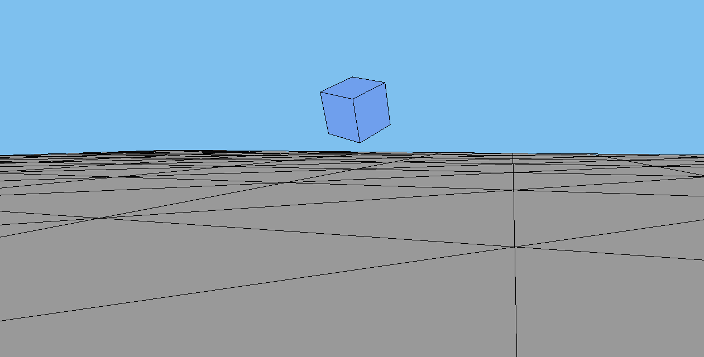

# A Demo of the Minimal Viable Product

## Screenshot

## How to Run
Open /client-media/index.html with Chrome.
Enter `file:///C:/Path/To/Repo/mvp/client-media/index.html` in the browser's url (for Windows).

## Done
- [x] pointerlock perspective control
- [x] normalized horizontal WASD movement
- [x] gravity, raytracing to land on the floor and objects

## Todo
- [ ] demonstrate walking on uneven floor
- [ ] demonstrate jumping to different floating platforms
- [ ] demonstrate jumping to different moving platforms
